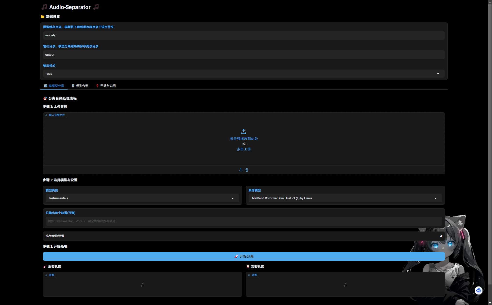

## 介绍

一个简化、但完善了 `ensemble` 功能的 [python-audio-separator](https://github.com/nomadkaraoke/python-audio-separator/tree/main) 的UI程序。大量参考了其他开源代码

- 专注 `Rofomer` 系列模型
- 实现了 `ensemble` 功能
- 简单易用、逻辑清晰、说明详细

## 安装

- 请参照[python-audio-separator](https://github.com/nomadkaraoke/python-audio-separator/tree/main) 的安装说明首先安装该库
- 国内pip 没速度请参看[pypi | 镜像站使用帮助 | 清华大学开源软件镜像站 | Tsinghua Open Source Mirror](https://mirrors.tuna.tsinghua.edu.cn/help/pypi/)
- 待更新。。。

## 已知问题

- 模型下了一半就停止的话一定会损坏，因为模型寻找和下载用的是别人的库，要修改库非常不方便，只能麻烦大家去[this link](https://github.com/nomadkaraoke/python-audio-separator/releases/tag/model-configs)下载后手动替换了
- 由于gradio框架限制，及时取消非常困难，反正一般也就二十秒，如果以后做win APP，正儿八经的分层做我会考虑的

## TO DO

- [X] 能中止处理（放弃了，gradio实在太麻烦）
- [X] `ensemble` 下切换模型类别后清空
- [X] `ensemble` 选择后检查所选模型是不是大于 1
- [X] 错误能在前端被渲染 而不是只显示错误
- [ ] 简化安装
- [ ] 保存会话信息，保存用户上一次使用的模型和参数
- [ ] 模型分数展示（leader board）
- [X] 多语言支持

## Credits 🙏🙏🙏🙏

- python-audio-separator by [beveradb](https://github.com/beveradb).
- Thanks to [UVR5 UI](https://github.com/Eddycrack864/UVR5-UI), this project is basically a imitation of it.
- Thanks to [dgfsfxc-tgsacxs-otyhrhs](https://huggingface.co/spaces/ASesYusuf1/dgfsfxc-tgsacxs-otyhrhs/blob/main/gui.py), which many of the code in this repo was copied from.
- Thanks to [Anjok07](https://github.com/Anjok07) and [Ultimate Vocal Remover GUI](https://github.com/Anjok07/ultimatevocalremovergui), which is the beginning of everything.
- Thank you to all the authors of the open-source model involved!

## License

This project is licensed under the MIT License - see the [LICENSE](LICENSE) file for details.
